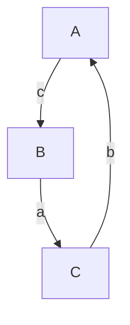
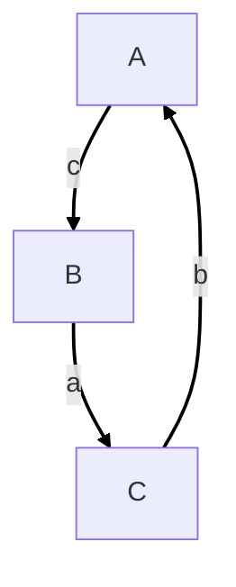

# OSNOVNI POJMI O KOTNIH FUNKCIJAH

```latex
\begin{tikzpicture}
\coordinate [label=left:{$B$}] (B) at (0,0);
\coordinate [label=right:{$C$}] (C) at (4,0);
\coordinate [label=above:{$A$}] (A) at (0,3);

\draw (A) -- node[left] {$c$} (B) -- node[below] {$a$} (C) -- node[above right] {$b$} (A);

\draw (0,0) rectangle (0.3,0.3);
\end{tikzpicture}
```






