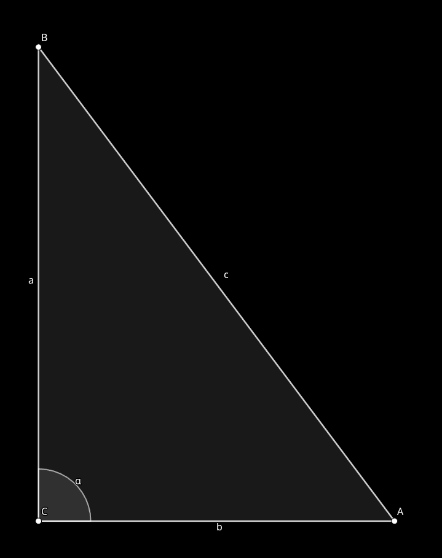
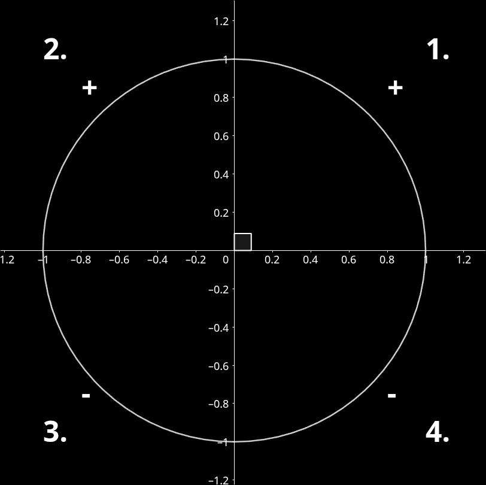
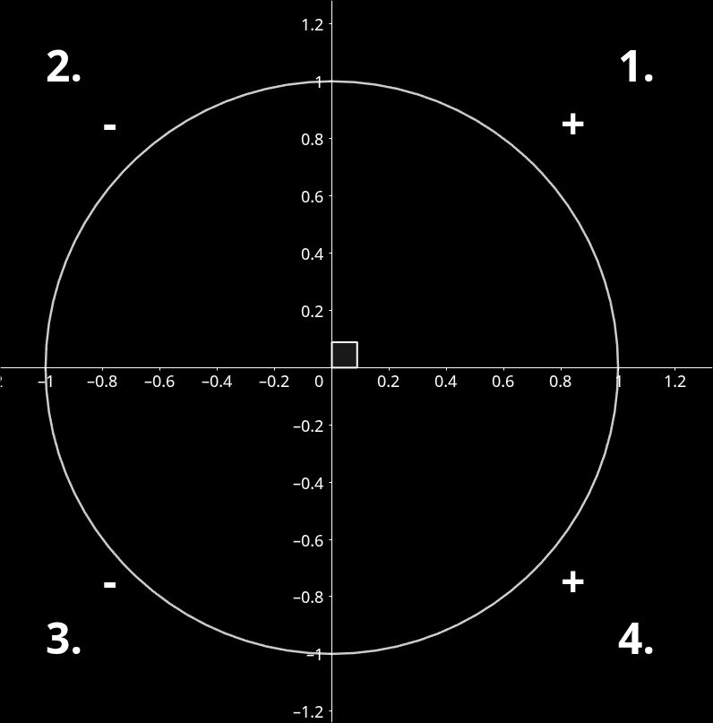
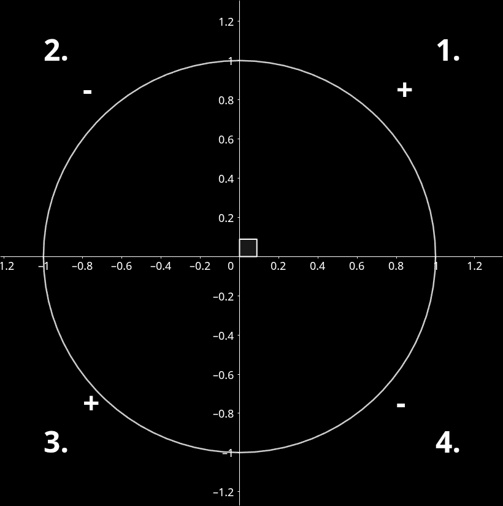
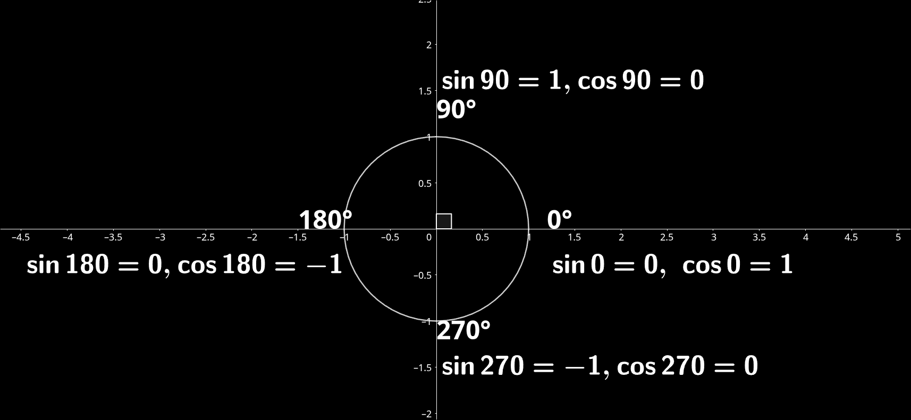

# OSNOVNI POJMI O KOTNIH FUNKCIJAH

## KOTNE FUNKCIJE V PRAVOKOTNEM TRIKOTNIKU

$\sin{\alpha} = \frac{nasprotna kateta}{hipotenuza} = \frac{a}{c}$

$\cos{\alpha} = \frac{priležna kateta}{hipotenuza} = \frac{b}{c}$

$\tan{\alpha} = \frac{nasptronta kateta}{priležna kateta} = \frac{a}{b}$ tudi $\tan{\alpha} = \frac{\sin{\alpha}}{\cos{\alpha}}$

$\cot{\alpha} = \frac{priležna kateta}{nasprotna kateta} = \frac{b}{a}$ tudi $\cot{\alpha} = \frac{\cos{\alpha}}{\sin{\alpha}}$ ali pa $\cot{\alpha} = (\tan{\alpha})^{-1}$

## DEFINICIJE KOTNIH FUNKCIJ NA ENOTSKI KROŽNICI

### Y koordinata
Če imamo enotsko krožnico(polmer = 1 enota) in na njen narišemo poljubno točko T v prvem kvadrantu(levo zgoraj), potem je y koordinata te točke enaka $\sin{\alpha}$($\frac{nasprotna kateta}{hipotenuza} = \frac{y}{1} = y$, ker je dolžina hipotenuze 1, saj točka T leži na krožnici z polmerom 1)

### X koordinata
Enako je z x koordinato, ki je enaka $\cos{\alpha}$($\frac{priležna kateta}{hipotenuza} = \frac{x}{1} = x$)

# LASTNOSTI FUNKCIJ
## PREDZNAKI FUNKCIJ V POSAMEZNIH KVADRANTIH
### Sinus

### Cosinus

### Tangens

### Cotangens

## NARAŠČANJE IN PADANJE VREDNOSTI FUNKCIJ

| $\alpha$       | 0° -> 90°     | 90° -> 180° | 180° -> 270°  | 270° -> 360°(0°) |
| -------------- | ------------- | ----------- | ------------- | ---------------- |
| $\sin{\alpha}$ | **+** narašča | **-** pada  | **-** pada    | **+** narašča    |
| $\cos{\alpha}$ | **-** pada    | **-** pada  | **+** narašča | **+** narašča    |

## OMEJENOST
Sinus in cosinus sta obe omejeni navzgor in navzdol. Zgornja meja(označena z **M**) je 1, spodnja(označena z **m**) pa -1.

# POGOSTE VREDNOSTI FUNKCIJ

| $\alpha$       | 0°             | 30°                  | 45°                  | 60°                  | 90°            |
| -------------- | -------------- | -------------------- | -------------------- | -------------------- | -------------- |
| $\sin{\alpha}$ | 0              | $\frac{1}{2}$        | $\frac{\sqrt{2}}{2}$ | $\frac{\sqrt{3}}{2}$ | 1              |
| $cos{\alpha}$  | 1              | $\frac{\sqrt{3}}{2}$ | $\frac{\sqrt{2}}{2}$ | $\frac{1}{2}$        | 0              |
| $tan{\alpha}$  | 0              | $\frac{\sqrt{3}}{3}$ | 1                    | $\sqrt{3}$           | **NE OBSTAJA** |
| $cot{\alpha}$  | **NE OBSTAJA** | $\sqrt{3}$           | 1                    | $\frac{\sqrt{3}}{3}$ | 0              |

# PRETVARJANJE KOTNIH FUNKCIJ TOPIH KOTOV V OSTRE KOTE
Če moramo izračunati vrednost sinusa ali cosinusa za kot večji od 90°(topi kot) potem uporabimo eno izmed sledečih enačb glede na vrednost kota.
## 90° < $\alpha$ < 180° 
Sinus in cosinus $\alpha$ zapišemo kot 180° - $\beta$, nato pa odstranimo 180° da dobimo končno vrednost.
$\sin{\alpha} = \sin{(180° - \beta)} = \sin{\beta}$

$\cos{\alpha} = \cos{(180° - \beta)} = - \cos{\beta}$

## 180° < $\alpha$ < 270°
Sinus in cosinus $\alpha$ zapišemo kot 180° + $\beta$, nato pa odstranimo 180° da dobimo končno vrednost.
$\sin{\alpha} = \sin{(180° + \beta)} = -\sin{\beta}$

$\cos{\alpha} = \cos{(180° + \beta)} = - \cos{\beta}$

## 270° < $\alpha$ < 360°
Sinus in cosinus $\alpha$ zapišemo kot 180° + $\beta$, nato pa odstranimo 180° da dobimo končno vrednost.
$\sin{\alpha} = \sin{(360° + \beta)} = -\sin{\beta}$

$\cos{\alpha} = \cos{(360° - \beta)} = \cos{\beta}$

# RAČUNANJE KOTNIH FUNKCIJ Z RADIANI
Če imamo moramo izračunati vrednost kotne funkcije nekega kota zapisanega z radiani namesto z stopinjami uporabimo izraz $\pi = 180°$. Če imamo kot zapisan kot ulomek z $\pi$, potem $\pi$ zamenjamo z kotom 180°, pred tem pa seveda ulomek **čim bolj poenostavimo**.

Če vrednost kota presega $2\pi$ potem uporabimo lastnost kotnih funkcij - **periodičnost**. Da je funkcija periodična pomeni da se bodo vrednosti funkcije po nekem času začele ponavljati. Pri kotnih funkcijah se vrednosti ponovijo vsakih 360° oz. $2\pi$ radianov. 
## PRIMERI
$\frac{\pi}{2} = \frac{180°}{2} = 90°$

$\frac{53 \pi}{4} = 13\frac{1}{4}\pi$ -> odštejemo $2\pi$ dokler ni vrednost manj kot $2\pi$(zaradi periodičnosti) torej dobimo $1\frac{1}{4}\pi$ kar izrazimo kot $1\pi + \frac{1}{4}\pi$, potem pa izračunamo samo sin/cos od $\frac{1}{4}\pi$ ker je $\pi = 180°$ in je prejšnji izraz enako kot $180° + 45°$.

# POMEMBNE ENAČBE

$\sin^{2}\left(\alpha\right) + \cos^{2}\left(\alpha\right) = 1$

$\sin{(\alpha + \beta)} = \sin{\alpha} * \cos{\beta} + \sin{\beta} * \cos{\alpha}$

$\sin{(\alpha + \beta)} = \sin{\alpha} * \cos{\beta} + \sin{\beta} * \cos{\alpha}$

$\cos{(\alpha + \beta)} = \cos{\alpha} * \cos{\beta} - \sin{\alpha} * \sin{\beta}$

$\cos{(\alpha - \beta)} = \cos{\alpha} * \cos{\beta} + \sin{\alpha} * \sin{\beta}$

$\tan{\alpha} = \frac{\sin{\alpha}}{\cos{\alpha}}$

$\cot{\alpha} = \frac{\cos{\alpha}}{\sin{\alpha}}$

$\cos{\frac{\alpha}{2}} = \sqrt{\frac{1 + \cos{\alpha}}{2}}$

$\sin{\frac{\alpha}{2}} = \sqrt{\frac{1 - \cos{\alpha}}{2}}$
