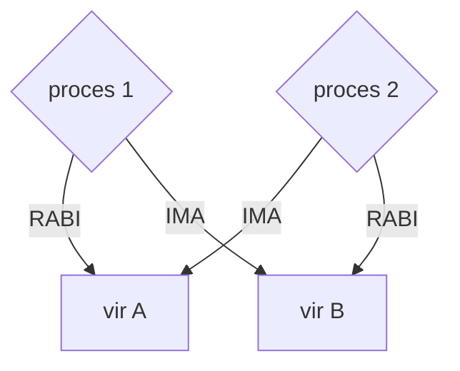

# LINUX UKAZI
## DOVOLJENJA/PRAVICE DATOTEK
Vsaka datoteka na disku ima zapisane pravice - kdo lahko z to datoteko kaj dela. Imamo 9 pravic, ki so ločene na 3 skupine:
1. User - uporabnik ki je to datoteko ustvaril
2. Group - vsi uporabniki ki so v enaki skupini kot uporabnik ki je to datoteko ustvaril
3. Other - vsi ostali uporabniki

Vsaka skupina ima 3 možne pravice:
- Read - branje datoteke
- Write - pisanje/spreminjanje datoteke
- Execute - izvajanje datoteke (v primeru če je program)

Te pravice zapišemo po skupinah skupaj. Prve 3 pravice označujejo pravice ki jih ima User, druge 3 pravice označujejo 3 pravice ki jih ima Group in zadnje 3 pravice označujejo katere pravice ima Other. 
Zapisane so z 9 biti in prikazane v formatu:
`rwxrwxrwx`

Lahko so zapisane tudi v osmiškem formatu - kot 3 števila, vsako z maksimalno vrednostjo 7, ki predstavlja vse pravice za to skupino

Na tistem mestu kjer je črka pomeni da tista skupina to pravico ima, če ni črke ampak je `-` potem pomeni da tista skupina te pravice nima

Primer:
`rwxrw-r--`

| Skupina            | User                 | Group       | Other |
| ------------------ | -------------------- | ----------- | ----- |
| pravice            | rwx                  | rw-         | r--   |
| pravice - dvojiško | 111                  | 110         | 100   |
| pravice - osmiško  | 7                    | 6           | 4     |
|                    | Read, Write, Execute | Read, Write | Read  |

Če zapis z črkami pretvorimo v dvojiški zapis, tako da črke zamenjamo z 1 in prazna mesta/`-` z 0, potem dobimo dvojiški zapis pravic. Če pa ta zapis pretvorimo v desetiški format (uradno rečemo da so zapisane v osmiškem formatu, ampak njihova vrednost je enaka kot če bi pretvorili v desetiški format), potem dobimo skrajšan zapis teh pravic, ki ga Linux tudi razume. Tako da ko spreminjamo pravice z `chmod [pravice] [ime_datoteke]` lahko pravice zapišemo kot `764` za zgornji primer namesto `rwxrw-r--`.

### Ukaz za spreminjanje pravic
Da spremenimo pravice do neke datoteke uporabimo ukaz `chmod`, ta ukaz vzame kot argumente najprej nove pravice in nato še ime datoteke, kateri pravice spreminjamo.

Če želimo pravice datoteke `naloga.docx` spremeniti tako da bo uporabnik imel vse pravice, skupina in ostali pa samo pravico do branja, bomo to zapisali kot `chmod 744 naloga.docx`. Pravice moramo zapisati v osmiški obliki (7 ker želimo da ima uporabnik vse pravice - 111(rwx), 4 ker želimo da ima skupina samo pravico do branja - 100(r--) in še enkrat 4 za ostale). Lahko pa pravice tudi zapišemo v formatu `u=rwx, g=rw, o=r` kjer prva črka pred enačajem predstavlja kdo ima določene pravice, pomembno je da so skupine ločene z vejicami

Če pa želimo določene pravice samo dodati ali odvzeti bomo namesto enačaja napisali samo +/-, glede na to katere pravice želimo dodati ali odvzeti. Recimo da žalimo ostalim dati pravico do pisanja datoteke, brez spreminjanja ostalih pravic, potem bomo napisali `chmod o+x naloga.docx` 

## SPREMENLJIVKE V LINUX SHELLU
V Linux Shellu lahko delamo spremenljivke. Če jo želimo ustvariti napišemo v Shell ime spremenljivke, nato enačaj in v narekovajih njeno vrednost, pri tem nesmemo uporabljati presledkov razen v vrednosti. Npr.: `TEST="to je test"`. Če želimo to spremenljivko kasneje uporabiti moramo pred ime dati znak `$` da Shell ve da je to spremenljivka in jo mora zamenjati z njeno vrednostjo preden izvede ukaz, npr.: `echo $TEST` bo izpisalo `to je test`.

## OSTALI UKAZI
- `cal` - izpiše koledar
- `ls -l` - izpiše datoteke in podmape, ki se nahajajo v trenutni mapi
- `cd [ime_mape]` - nas premakne v drugo mapo
- `cd ..` - nas pomakne eno mapo nazaj
- `whoami` - izpiše ime trenutnega uporabnika
- `users` - izpiše vse trenutno prijavljene uporabnike
- `df -h` - izpiše porabo diskov
- `logout` - izpiše trenutno prijavljenega uporabnika
- `halt` - v trenutku izklopi računalnik
- `vi` - odpre urejevalnik teksta po imenu vi
- `cat` - izpiše vsebino trenutne datoteke
- `wc` - prešteje besede v datoteki
- `cp` - kopira datoteke 
- `mv` - premakne ali preimenuje datoteko
- `rm` - izbriše datoteko
- `ln` - ustvari link do datoteke
- `grep` - filtrira izpis - npr.: `cat test.txt | grep "abc"` če hočemo izpisati samo vrstice ki vsebujejo niz abc v datoteki test.txt

Podrobna dokumentacija ukazov je na tej spletni strani: linux.die.net/man/

# OPERACIJSKI SISTEMI
## VRSTE
- preprosti paketni - brez uporabnika, serijsko obdeluje neke podatke
- multi-programski paketni - istočasno obdelovanje večih podatkov
- sistemi z dodeljevanjem časa - čas CPUja razdelijo med procesi (UNIX)
- sistemi osebnih računalnikov - 1 uporabnik, prijazen vmesnik
- paralelni sistemi - za računalnike(strežnike) z več CPUji in skupnim pomnilnikom
- porazdeljeni sistemi - ko imamo omrežje računalnikov(strežniška farma) in si delijo nekatera sredstva (npr.: diske)
- sistemi za delo v realnem času - strogo določeno kdaj se kateri proces izvede in kako dolgo se izvaja, so zelo zanesljivi (RTOS)
- mobilni sistemi - prilagojeni mobilnim napravam

## SHELL - LUPINA
je program ki posreduje ukaze med uporabnikom ter jedrom operacijskega sistema. Vzame ukaz uporabnika ter prevede v nekaj kar lahko jedro OSa razume, če jedro kaj vrne, program to potem tudi posreduje nazaj uporabniku

Shell vsebuje tolmača ki ukaz prebere in ga razdeli na posamezne dele (ime programa, argumenti in pot - obvezno je samo ime programa). Potem tolmač nadomesti posebne znake in okoljske spremenljivke z njihovimi vrednostmi. Na koncu ta ukaz ivzede, če mora zagnati kak program najprej naredi otroški proces s sistemskim klicom fork(), zažene ta program in čaka na njegov zaključek. Na sproti izpisuje to kar program piše na standardni izhod, no koncu uniči otroški proces ko se program zaključi

## PROCESI
- Proces je program ki se izvaja oz. je naložen v delavni pomnilnik
- En sam program lahko ustvari več procesov

### Stanja procesa
Proces med izvajanjem prehaja skozi različna stanja, ki jih nadzoruje OS.

- New - ravno bil ustvarjen, nima še dodeljenih virov in se zato ne izvaja
- Ready - ima vse potrebne vire, ampak čaka da mu OS dodeli čas na CPUju. V tem stanju je lahko več procesov na enkrat ko čakajo v čakalni vrsti na izvajanje.
- Running - trenutno uporablja procesor in se izvaja. V danem trenutku se lahko izvaja samo en proces na jedro CPUja
- Blocked/Waiting - čaka na neko operacijo npr.: branje datoteke. Procesor ga ne izvaja dokler ni operacija dokončana
- Terminated - proces se je končal (uspešno ali zaradi napake). Njegovi viri se sprostijo in sistem ga odstrani iz pomnilnika

### Večnitnost - Multithreading
Je postopek v katerem se izvaja več niti znotraj enega procesa. Vsak proces ima vsaj eno - glavno nit, če pa programer napiše program z zmožnostjo deljenja na več niti bo ta proces deloval hitreje in učinkoviteje ker so bo lahko več stvari izvajalo hkrati.
Vsaka nit v procesu predstavlja del programa ki se lahko izvaja neodvisno.
Z njimi upravlja OS.

## RAZVRŠČEVALNI ALGORITMI
- FCFS - first come, first served
- SJF - shortest job first
- Round Robin - vsak proces ima določen čas na voljo
- Prioritetno razvrščevanje - vsak proces ima prioriteto - višja prioriteta pomeni da se proces prej izvede - ima problem deadlocka

### Deadlock

- Doben se nebo končal ker čaka na drugega da sprosti vir
- Vzroki:
	- Vzajemna blokada virov
	- Neprekinjeno čakanje
	- Krožna odvisnost med procesi
- Rešitve:
	- Vnaprej definiran vrstni red zavzemanja virov (npr.: vsak proces najprej dobi disk, nato grafično kartico, nato mrežno kartico...)
	- končaj 1 proces

## ZAGON RAČUNALNIKA
1. vklop napajanja
2. POST - Power On Self Test - preveri delovanje procesorja, pomnilnika...
3. inicializacija BIOS/UEFI - nastavitev sistemske ure, konfiguracija naprav
4. Nalaganje zagonskega nalagalnika (Bootloader) - BIOS/UEFI poišče zagonski nalagalnik na trdem disku, SSDju ali USBju in ga naloži v pomnilnik
5. nalaganje OS - zagonski nalagalnik prenese jedro OSa v glavni pomnilnik in inicializira vse komponente, vključno z gonilniki, storitvami in programi
6. inicalizacija sistemskih storitev
7. nalaganje uporabniškega vmesnika - naloži namizje, ukazno vrstico, prijavni zaslon...

## UPRAVLJANJE POMNILNIKA
Enota za upravljanje pomnilnika se imenuje MMU - Memory Managment Unit

## DATOTEČNI SISTEMI
- je del OSa ki omogoča shranjevanje, organizacijo in dostop do podatkov na pomniliških napravah(RAM, SSD, HDD, USB disk...)
- organizira podatke v hierarhično strukturo, ki vključuje mape/imenike in datoteke. Mape lahko vsebujejo tudi podmape za boljšo organizacijo
- upravlja način dostopa do podatkov, vključno z branjem in pisanjem datotek. Skrbi za varnost podatkov z uporabo dovoljenj in šifriranjem