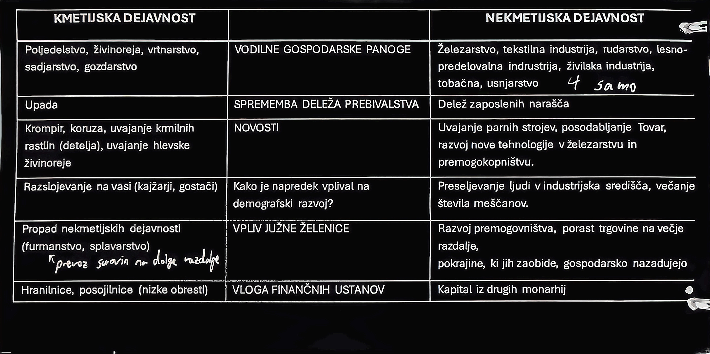

# ZAČETKI SLOVENSKEGA MEDNARODNEGA GIBANJA
- Reforme Marije Terezije in Jožefa 2.
- Najpomembnejši čebelar tega časa je *Anton Janša*(čebelnjak v Brezovici)

## ZAČETKI NARODNEGA PRERODA
- obdobje pred marčnim obdobjem
- **Pohlinov krožek**(redovniki, kranjska gramatika, pisanice, Pohlinov trojezični slovar)
- **Zoisov krožek** - Žiga Zois(bogat in na vozičku)
- Ostali: 
	- *Baltazar Haquet* - naravoslovec
	- *Jurij Japelj* - jezikoslovec, prevajalec
	- *Valentin Vodnik* - kuharske bukve, babištvo
	- *Anton Tomaž Linhart* - Županova micka, Ta veseli dan ali Matiček se ženi
	- *Jernej Kopitar* - 1. slovenska znanstvena slovnica

## ILIRSKE PROVINCE
- Dobimo univerzo ki po razpadu ostane
- Slovenščina v šolah
- Italjanščina samo na uradih
- Dobijo človekove pravice

## KRALJEVINA ILIRIJA (1816 - 1849)
- Izoblikujeta se 2 tabora
### Konservativni
- **kmetijske in rokodelske novice** - 1843 - 1902 v Ljubljani
- *Bleiweis*
- Poučevanje kmetov in rokodelcev
- večino časa je to edini slovenski časopis
- pozivajo k šolanju in napredku
- vzpodbujajo narodno zavest
- izogibajo se kontroverznih političnih vsebin
- konča **črkarsko vojno**

### Liberalni
- **Kranjska čbelica** - 1830 - 1834 + 1848 v Ljubljani
- *Kastelic*
- Razširjanje slovenščine med izobraženci
- podpira ga večina takratnih pesnikov(Prešeren, Čop)
- imeli so probleme s cenzuro

## ČRKARSKA PRAVDA
- v 1. polovici 19. stoletja
- pisava *Danjčica* se razvije na Štajerskem
- pisava *Metelčica* se razvije na Kranjskem
- na koncu se uveljavi gajica

## ILIRIZEM
- po letu 1830
- nastane zaradi germanizacije iz severa
- Južni slovani so bili imenovani *Iliri*
- sestavljajo ga 4 glavni slovanski jeziki(ruski, češki, poljski in ilirski)
- Slovenščina bi naj bila jezik "preprostega ljudstva"
- pomembna oseba tistega časa je bil *Ljudevit Gaj*
- privrženca pa sta bila: **Stanko Vraz** in **Matija Major Ziljski**
- nasprotniki pa: Čop, Prešeren, Bleiweis in Slomšek

# BACHOV ABSULUTIZEM
- obdobje po zadušitvi revolucije med letoma 1849 in 1859 v Avstriji
	- obnovili naj bi stari red in monarhijo
	- prepovedano je bilo vse povezano z revolucijo
	- nadzorovali so knjigarne, družabne prireditve, gledališke predstave in politične posameznike
	- onemogočeno je bilo skoraj celotno politično delovanje - **STROGA CENZURA**
- V upravi in sodstvu je bil uradni jezik **nemščina**(jezikovna enakopravnost se v praksi ni uveljavljala)
- Anton Alojzij Wolf je financiral izdajo slo-nem in nem-slo slovarja ter začel izdajati novi prevod svetega pisma
- 1851 nastane *Mohorjeva družba* na pobudi škofa *Slomška*
- Peter Kozler naredi 1. zemljevid, ki obsega slovenske dežele in okolje

# POLITIČNO DELOVANJE SLOVENCEV
## SLOVENSKA DRUŠTVA - ČITALNICE
- so kulturna društva v katerih so se zbirali takratni slovenski izobraženci in meščani
- ustanavljali so jih po večjih trgih in mestih(1. v Trstu, največ na Goriškem)
- **namen**: uveljavljanje slovenščine v javnosti s predavanji, deklaracijami, glasbenimi večeri in igrami
- ustanavljali so prireditve ki so jih imenovali "besede" - to so bile igre
- **pomen**: slovenščina se je uveljavila kot pogovorni jezik zraven nemščine, krepila se je narodna zavest in razvijala kulturna dejavnost

## MARIBORSKI PROGRAM
- 25.6.1865
- želijo obnovitev notranje Avstrije(Štajerska, koroška, kranjska in Goriška - pride kasneje)
- Andrej Ginspilez

# POLITIČNI SMERI
## MLADOSLOVENCI
- Fran *Levstik*, Josip *Jurčič* in Josip *Vošnjak*
- bili so liberalni/napredni
- geslo: **vse za domovino, omiko in svobodo**
- organizirali so tabore
- izdajali lasten časopis: *slovenski narod*
## STAROSLOVENCI
- Janez Bleiweis
- bili so konzervativni
- geslo: **vse za vero, dom in cesarja**, **delu, čast in slava**
- zagovarjali so *mariborski program*
- izdajali so lasten časopis: *novice*

### Zborovanje na prostem - TABORI
- 1868 - 1871
- velika zborovanja - želeli so navdušiti množice za narodno politiko
- 1. v Ljutomeru - sledilo je 18 taborov(največji v Vižmarjah pri Ljubljani), pogosti so bili na robu etničnega ozemlja
- **zahteve**: 
	- uresničitev programa *Zedinjena Slovenija*
	- uveljavitev slovenskega jezika v šolah in uradih
	- govorili so o gospodarskih, socialnih in lokalnih vprašanjih
- **pomen**: krepila se je slovenščina, narodna zavest in politične zahteve

# TAFARJEVA VLADA
- OBDOBJE SLOGE
- težko obdobje za Slovence - *povečan nemški pritisk*(premeščanje uradnikov)
- *slabe razmere* za uveljavljanje političnih zahtev

# POLITIČNE STRANKE
## LIBERALNI TABOR
- zavzemal za odločilno narodno politiko in zagovarjali so politično ter gospodarsko svobodo
## KATOLIŠKI TABOR
- zagovarjali so vpliv cerkve v javnem življenju

- od 1875 - 1890 sta sodelovala - zato ta leta imenujemo leta **sloge**
- zaradi rasti industrije se je v zadnjih desetletjih 19. stoletja povečalo število delavcev in razvijati se je začelo **delavsko gibanje**(delavska društva in delavski časopisi)
**UČB str. 176 - POLITIČNE STRANKE**

## STRANKE

| Slovenska ljudska stranka                                                       | Narodno napredna stranka                   | Jugoslovanska socialdemokratična stranka                                 |
| ------------------------------------------------------------------------------- | ------------------------------------------ | ------------------------------------------------------------------------ |
| kmetje, meščani                                                                 | bogati meščani, izobraženci, veliki kmetje | delavci                                                                  |
| izboljšat položaj kmeta, volilna pravica za vse moške, želijo da ima vera vpliv | Zedinjenja slovenija                       | socialistična družba, borijo za pravice(8 urni delavnik, proste nedelje) |
| telovadno društvo: Orel                                                         | telovadno društvo: Sokol                   | telovadno društvo: Svoboda                                               |

# TRIALIZEM
- idea o trializmu - povezovanje južnoslovanskih narodov v monarhiji(slovenci, hrvati in srbi)
- To idejo so podpirali slovenski izobraženci, študentje in kulturniki
- **zahteve**: 
	- notranja avtonomija južnoslovanskih dežel
	- z AO bi jih povezovala le zunanja politika in skupen vladar

# PREPRODOVCI
- Preprodovci so bili člani mladinskega prevratniškega gibanja, zbrani okoli mesečnika *Preporod*
- zavzemali so se za nasilno razbitje države in povezovanje s Srbijo

# GOSPODARSKI RAZVOJ V SLOVENSKIH DRŽAVAH PO LETU 1848
## ZAČETKI INDUSTRIALIZACIJA
V Cukrarni v Ljubljani se pojavi 1. parni stroj

## ŽELEZARSTVO
Najpomembnejša in najmodernejša železarna je bila v *Prevaljah*(Brata Rosthorn) - izdelovala je železniške tračnice

## POMEMBNEJŠI PREMOGOVNIKI
- Leše, 
- Trbovlje
- Zreče

## DRUGA POLOVICA 19. STOLETJA
Dokončana je južna železnica proge Dunaj - Trst

## DELNIŠKE DRUŽBE V 19. STOLETJU
- KID - **K**ranjska **I**ndustrijska **D**ružba - železarstvo
- TPD - **T**rboveljska **P**remogokopna **D**ružba - premogovništvo
- Zadruge so skrbele za organizirano prodajo *izdelkov*, *pridelkov* in *izobraževanje kmetov*
- Zadružne posojilnice, hranilnice so dajale posojila z nizkimi obrestmi in so ljudi na tak način zavarovala pred oderuštvi(ko so ljudje na črno nekomu posodili denar z velikimi obrestmi in če nisi odplačal so te hudo kaznovali)

## MIGRACIJE
- Največ na Kranjskem, spodnji Štajerski in Koroškem
- Odhajali so v ZDA, Argentino, Kanado in Nemčijo z željo po boljšem življenju

### Ženske oblike izseljevanja
- V Egipt, kjer so delale kot dojilke(rekli so jim aleksandrijke) in služkinje
- V New York in Chicago - rekli so jim slamnikarice

# KAKO JE POTEKALA ZDRUŽITEV NEMČIJE
- Otto von **Bismarck** postane *pruski* kancler
- Imel je vzdevek *železni kancler* 
- Njegova cilja sta bila oslabitev Avstrije in združitev Nemčije

===POGLEJ SI SLIKO ZEMLJEVIDA Z ŠTEVILKAMI V UČENIKU O NEMŠKO-DANSKI VOJNI===

1. Avstrijsko cesarstvo zavzame *Schleswig in Holstein* - 1864
	- Danska vs. Prusija in Avstrijsko cesarstvo
2. Avstrijsko-pruska vojna - 1866
	- Kraljevina Italija dobi *Benečijo*
	- Prusija dobi *Schleswig* in *Holstein*
	- Oblikovana je **Severnonemška zveza**
	- Prusija in Italija vs. Avstrijsko cesarstvo
3. Francosko-pruska vojna - 1870-1871
	- Ustanovljeno je **Nemško cesarstvo**
	- Francija izgubi **Alzacijo** in **Loreno**
	- Francija vs. Prusija

## NEMŠKO CESARSTVO / RAJH
- Bismarck ostane kancler do 1890
- 22 držav + 3 svobodna mesta
- Federativna ureditev
- Navidezno liberalna ureditev
- 41 milijonov prebivalcev -> pojavljajo se nacionalna in verska nasprotja

# KAKO JE POTEKALA ZDRUŽITEV ITALIJE
## NACIONALNE IDEJE
- Italija je bila razdeljena na mnogo državic - ni imela enotnosti
- Zaradi industrijske revolucije in **gospodarskega razvoja** so se želeli združiti
- Ustanovi se tajno društvo **KARBONARJI** in organizacija **MLADA ITALIJA**

## DE CAVOUR
- 1852 ministrski predsednik
- Modernizira kraljestvo -> tuj kapital
- Zavzema se za pregon Avstrije in severnega dela A. polotoka
- Zavezništvo z Napoleonom 3.
- Prihaja iz **Piemonta** - Sardinija

## BITKA ZA MAGENTO
- 4.6.1859
- Prvič uporabijo železnico v vojaške namene
- Piemont s pomočjo Francije premaga Avstrijsko vojsko

## BITKA PRI SOLFERINU
- 24.6.1859
- Krvava bitka - ogromno mrtvih in ranjenih vojakov
- **Avstrijci priznajo poraz**
- *Henri Durant* je zaradi te bitke dobil idejo za **rdeči križ**

## MIR V VILLETRANCU
- Z Mirom v Villetrancu so s Francom Jožetom podpisali mirovno pogodbo
- Avstrija se je morala odpovedati *Lambardiji*, obdrži pa *Benečijo*(obe sta pomembni za Italijo)
- **Cavour odstopi kot predsednik vlade**
- Stari vladarji se vrnejo na svoje položaje

## GARIBALDI
- Ker združenje Italije ni bilo izvedeno, je iz kraljestva obeh Sicilij z združevanjem pričel **Garibaldi**
- Garibaldi je uspel združiti Italijo v kraljevino(1861-1946)
- Kralj je postal **Viktor Emanuel 2.**
- Garibaldi je kmalu izvedel pohod na Rim in priključil Italiji še **Benečijo** ter **Rim** postavil za **glavno mesto**
- Status Vatikana je kasneje uredil šele Musolini

# NASTANEK AVSTRO OGRSKE
- Z *oktobrsko diplomo* so Ogrski vrnili ustavni položaj kakšnega je imela pred revolucijo
- *Februarska ustava* je monarhijo spremenila v centralistično urejeno državo v avstrijsko prevlado(centralizem je isto kot germanizacija)
- Leta 1867 uvedejo **dualizem**(2 državi združeni v 1)
- Nastane zveza 2 suverenih držav v isti monarhiji
- Vladal je Franc Jožef (avstrijski cesar in ogrski kralj)
- Imeli so skupno zunanjo, obrambno in finančno politiko(Avstrija 70% in Madžarska 30% skupnih stroškov)
- Notranja organizacija vsakega dela je bila odločena z ustavo(vsak je imel svoj parlament)

## NACIONALNI PROBLEMI
- Po podpisu pogodbe so se ostali narodi počutili ogrožene in zapostavljene

## DECEMBRSKA USTAVA
- Ustava Avstro Ogrske je bila **DECEMBRSKA USTAVA**
	- Uvede nekatere človekove pravice
	- Omogoči ustanavljanje društev in taborov
	- Enakost državljanov pred zakonom in svoboda veroizpovedi
	- Splošna šolska obveza od 6. do 14. leta
	- Enakopravnost narodov in jezikov - **ni se upoštevala**

# KAKO SE JE SPREMEMBAM PRILAGAJALA CARSKA RUSIJA
- Bila je avtokratska država - strog režim

## KRIMSKA VOJNA (1853-1856)
- Rusija vs. Osmanski državi, Franciji, Veliki Britaniji in Sardinskemu kraljestvu
- Avstrijsko cesarstvo jim ne pomaga
- **PORAZ RUSIJE**

## ALEKSANDER 2.
- Uvajanje liberalnih idej -> osebna svoboda kmetom, reforme šolstva, ureditev financ, reforme vojske, modernizacija gospodarstva in gradnja železnice
- 1881 se zgodi atentat nanj -> rešitev Rusije je socialistična in egalitarna družba

## ALEKSANDER 3.
- Krepitev nadzora, cenzura, večja vloga plemstva, rusifikacija

## REVOLUCIJA 1905
- Generalna stavka, *krvava nedelja* -> Nikolaj 2. - oktobrski manifest, duma.

# KATERE SO BILE KLJUČNE ZNAČILNOSTI VELIKE BRITANIJE IN FRANCIJE NA PREHODU IZ 19. V 20. STOLETJE
## VELIKA BRITANIJA
- *Viktorijanska doba*(kraljica Viktorija)
- Boj Ircev za neodvisnost
	- Mlada Irska - radikalno združenje za dosego Irske avtonomije
- *Krompirjeva lakota*
- Irci dobijo samoupravo - razglasijo samostojno Irsko(en del še vedno ostane pod angleško oblastjo)

## FRANCIJA
- 2. republika - Luis Napoleon
- Državni udar
- cesarstvo - bonapartizem
- vojna s Prusijo

### Pariška komuna
V času Pariške komune so želeli z reformami *izboljšati življenje* ljudi(splošna oborožitev, ločitev cerkve in države in enakopravnost žensk), vse skupaj je bilo krvavo zatrto v krvavem tednu, kjer so obračunali z **komunardi**

## DREYFUSOVA AFERA

# KAKO SE JE BALKANSKI POLOTOK ZNAŠEL MED INTERESI VZHODA IN ZAHODA
## SRBIJA
- Družina Obrenović je bila povezana z Avstro Ogrsko
- 1903 - Peter Karađorđević -> povezava Z Rusijo - Velika Srbija
## BiH
- **protektorat Avstro Ogrske**
- Verska in nacionalna nasprotja kot v Nemčiji
- Mlada Bosna - povzročijo atentat
## MAKEDONIJA
- Je interes Srbije, Bolgarije in Grčije
- VMRO - boj proti Turškim oblasti

# BERLINSKI KONGRES
- 1878 Bismarck skliče Berlinski kongres
- Revidirajo Sanstefanski mir:
	- Srbija, Črna gora in Romunija dobijo *neodvisnost* 
	- Ustanovitev samostojne Bulgarske države
	- Avstro Ogrska dobi mandat za začasno upravljanje BiH
	- Odnosi med Rusijo in Nemčijo se zaostrijo
# ZAVEZNIŠTVA (PRED 1. SVETOVNO VOJNO)
## TROJNA ZVEZA
- Nemčija
- Avstro Ogrska
- Italija
- **Tajna zaveza**

## PRISRČNA ZVEZA
- Velika Britanija
- Francija
- **Zveza gospodarskih razlogov

# 1. SVETOVNA VOJNA
## VZROKI IN POVOD
Za začetek 1. SV je povezano dogajanje v Evropi v 2. polovici 19. stoletja:
- **imperializem**
- **kolonializem** 
- nacionalizem 
- **militarizem**
- boj za gospodarsko prevlado
- sistem zavezništev
- **tajna diplomacija**
- napačne politične odločitve 
- **Balkanski sod smodnika**

### Kolonializem
- Poceni surovine in delovna sila
- Razkazovanje moči
- Občutek superiornosti
- Ohranjanje ravnotežja sil

### Imperializem
- Država hoče kazat kako je boljša od druge
- Hočejo med politično in gospodarsko prevlado nad drugo državo

### Balkanski sod smodnika
1. Balkanska vojna 1912
	- *Bolgarija + Srbija, Grčija in Črna gora vs. Turčija*
2. Balkanska vojna 1913
	- *Romunija + Srbija + Grčija + Črna gora vs. Bolgarija*

## POVOD
- Atentat srbskega mladeniča Gavrila Principa na avstrijskega prestolonaslednika Franca Ferdinanda v Sarajevu na Vidov dan 28.6.1914
- Odločitev o vojni sprejmeta Nemčija in Avstrija po pogovorih
- Avstro Ogrska je postavila Srbiji ultimat v katerem je sprejela vse točke razen dveh, zato je Avstro Ogrska napovedala vojno

## VSTOP DRŽAV V VOJNO

| Antanta          | Centralne sile     | Nevtralne |
| ---------------- | ------------------ | --------- |
| Srbija           | Avstro Ogrska      | Švica     |
| Rusija           | Nemčija            | Švedska   |
| Francija         | 1915 Turčija       | Španija   |
| Velika Britanija | 1915 Bulgarija     |           |
| 1915 Italija     | Italija na začetku |           |
| 1917 ZDA         |                    |           |

# BOJIŠČA 1. SVETOVNE VOJNE
## BALKANSKO BOJIŠČE
Bojišče prvih bitk
Avstro Ogrska je prepričana da je Srbija oslabljena zaradi vojn na Balkanu

- Bitka na Ceru(Srbska vojska AO zada uničujoč poraz)
- Bitka na Kolobari(Srbska vojska premaga AO)
- Bitka na Drini(Savi in Donavi) - nemoč srbske vojske zaradi slabše opremljenosti in oboroženosti
- Salonska fronta(zavezniška front proti centralnim silam)

## ZAHODNO BOJIŠČE
- Območje najhujših bitk v 1. SV
- Schlieffnov načrt - **Blitzkrieg**
- Nov način bojevanja v jarkih - **pozicijsko bojevanje**

- Bitka na Marni - francoskim in britanskim vojakom uspe odbiti nemški napad
- Bitka za Ypres (kemično orožje)
- Bitka za Verdun (topniško obstreljevanje)
- Bitka na Somi (tanki, najbolj krvava - v 1 dnevu VB izgubi 57k vojakov)

## 1917 VSTOP ZDA V VOJNO
- Vstopijo zaradi gospodarskih interesov
- Imeli so večji vložek posojil in zato tudi večji interes za zmago
- Nemška podmorniška vojna(Lusitania)

## NOV NAČIN BOJEVANJA V JARKIH
Neprebojna linija rovov, bodeče žice, topniška in strojniška gnezd
- Zavezniška stran - 1,6 mio
- nemška - 850k

## VZHODNO BOJIŠČE
- Prevzelo je glavno težo bojevanja
- Prevzame ga AO (NEM na severu, AO na jugu)
- Je najdaljša fronta 1. SV(premikali so se za več 100km)
- Odprti način bojevanja

- **Bitka pri Mazurnih jezerih**

## AVSTRIJSKO ITALIJANSKO BOJIŠČE
- **Največji spopad** v *gorati pokrajini* v zgodovini
- Največji spopad na slovenskih tleh
- Topniško obstreljevanje

- **SOŠKA FRONTA** - 12. bitka(čudež pri Kobaridu)

## VOJNA V KOLONIJAH
- Velika Britanija naredi pomorsko blokado Nemčiji
- Podmorniške akcije in nastavljanje min
- 1.5.1915 Lusitania
- 31.5. in 1.6. bitka pri Sutlandiji
